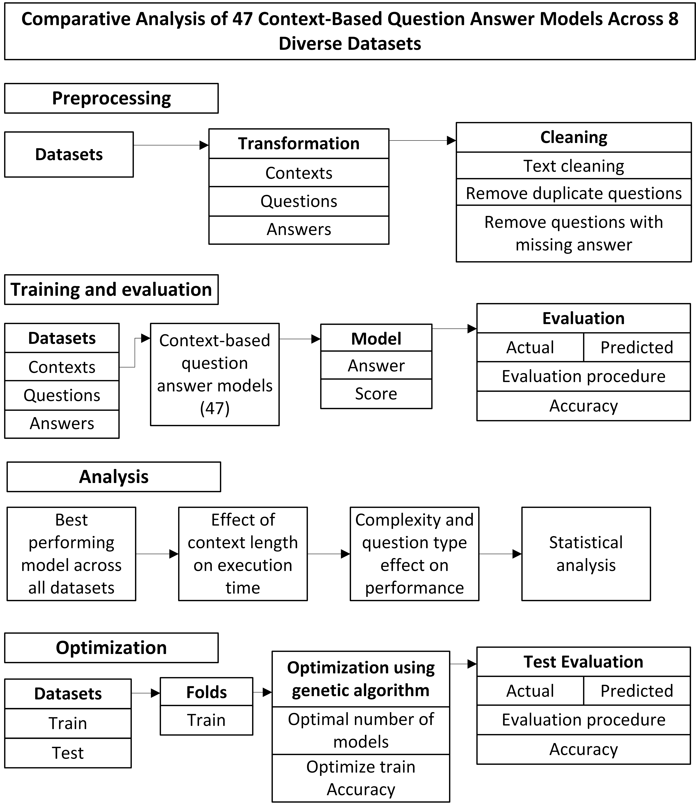

# Comparative-Analysis-of-47-Context-Based-Question-Answer-Models-Across-8-Diverse-Datasets

Download processed data from this link: https://osf.io/rd3x2/?view_only=7f9bd36e0d974268b610419e8241dc8a

Merge directories from GitHub and OSF.

